```{r Setup, include=FALSE, results='hide', warning=FALSE}

opts_chunk$set(fig.path="../assets/wk01-fig-",
               cache.path="../cache/wk01-working-",
               dev=c("png","pdf"),
               fig.width=6,
               fig.height=5,
               dpi=300,
               fig.show="hold",
               fig.lp="fig:",
               cache=TRUE,
               par=TRUE,
               echo=TRUE,
               message=FALSE,
               warning=FALSE)

opts_knit$set(kfigr.prefix=TRUE,
              kfigr.link=FALSE)


```

- Outline 
- Housekeeping
- Motivation and Goals
- Up and running with R and RStudio
- A First Figure in R

 

# Housekeeping

## [http://socviz.github.io/soc880/](http://socviz.github.io/soc880/)

- Slides, code, and other material will be available there.
- The site is hosted on GitHub.
- Take a look at that here: [https://github.com/socviz/soc880](https://github.com/socviz/soc880)
- Soon we'll get you access for private repositories where you can put your assignments.


# We want to create pictures of data that people, including ourselves, can look at and learn from

- Slides and other material for this class will be fairly interactive and hands-on. More like working notes than the sort of thing you would present as finished work, or to an audience
- Code you can use in R will look like this:

```{r example, echo=TRUE}

## This is a comment
data <- c(1, 1, 4, 1, 1, 4, 1)

data

```

- The first box shows something you can type into the R console. The second shows what you'd see as output if you did.


# How to take notes in this class

- Use a text editor. Not MS Word. It's easiest to work with RStudio. Create a new project there.
- We will want to alternate back and forth between bits of code and explanatory notes to ourselves, commentary, or other material. We need a format to do this in that still allows us to work in R easily. 
- Create an RMarkdown file in the directory. RStudio sets up a quick template for you. Save the file, calling it `week-01-notes.Rmd`.
- You won't use RMarkdown for everything you do. Very short project might just need a single `.r` file. Very large projects may need more organization. 
- But it's good for taking notes while also working with snippets of code. Note that RStudio has various keyboard and menu shortcuts to help you edit quickly.
- RMarkdown documents can have all kinds of options and other paraphernalia added. Never mind about those for now. Just stick with the defaults.


## What's happening behind the scenes

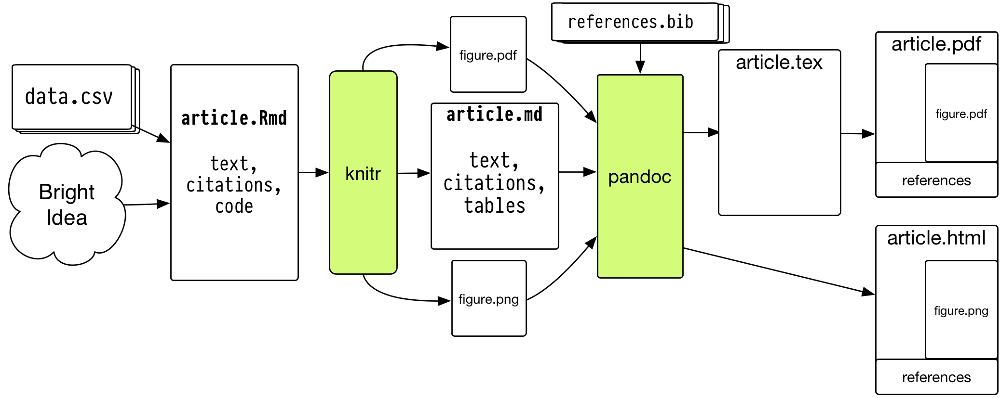

- RStudio will take care of this for you, so don't panic. 


## Why does it need to be so cumbersome?

- You may be used to thinking of your final document (e.g. a Word
  file, PDF, or presentation slides, or the tables and figures you
  make) as what's "real" about your project.
- It's better to think of the data and code as what's real, together
  with the text you write.
- The idea is that all of the finished outputfigures, tables,
  etcis, as much as is reasonable, procedurally and reproducibly
  generated from your code, data, and text.
- Reproducibility is important to the scientific process. But the
  reality for most of us is that the person you most want to be able
  to reproduce your work is *you*, six months or a year from now.


## This still seems like kind of a pain in the ass 

- Working in plain text can be annoying.
- But we need to write code that R (or Stata) can understand.
- And we really do need to have a way to remember what we did.
- Plain text files are a robust and easy-to-share format.
- So, as much as possible, keep things simple inside your files.


# When working in R ...

## A little organization goes a long way

- Make sure you know where you are.

```{r getwd}

## Get the working directory
getwd()

```


- A little organization can help a lot

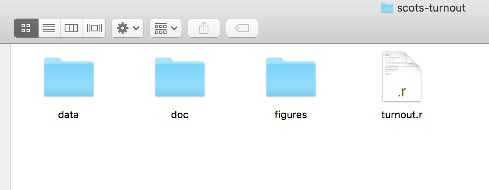


- More complex projects may have a more complex structure
- Rstudio can help with project organization as well.

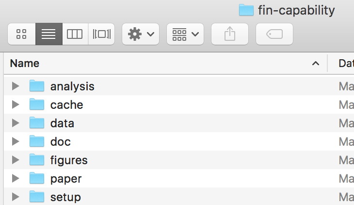


## Everything has a *name*

- Some names are forbidden. These include words like `FALSE` and `TRUE`, logical operators and programming words like `Inf`, `for`, `else`, `break`, `function`, and words for special entities like `NA` and `NaN`.
- Some names you should not use. These include words that are also the names of very widely used objects like `q` or `c` or `mean`, or `pi`, or `range`, or `var`.
- All names are case sensitive.


## Everything is an *object*

- Objects are built in to R, are added via libraries, or are created by the user.

```{r objects, echo=TRUE}

## This is a vector of numbers

my_numbers <- c(1, 2, 3, 1, 3, 5, 25)

my_numbers

summary(my_numbers)

```


## Every object has a *class*

- Depending on what type of object something is, you can extract bits of information from it.

```{r classes, echo=TRUE}

class(my_numbers)

class(summary)

```


## Functions take Data (or Functions) as inputs, and produce outputs

```{r functions, echo=TRUE}

## A Function takes arguments inside parentheses 
my_summary <- summary(my_numbers)

class(my_summary)

my_summary

```


## When working in R ...

- For now just remember that you do things in R by creating and manipulating objects, and that you manipulate objects by feeding them to functions and getting output back as a result.

```{r output}

my_numbers * 2

table(my_numbers)

sd(my_numbers)

```

## If you're not sure what something is, ask for its class:

```{r getclass}

class(my_numbers)

class(my_summary)

class(table)

```

## If you're not sure what something is, ask for its structure

```{r str}

str(my_numbers)

str(my_summary)

str(summary)

```


# Before we get lost in the Weeds, let's look at some pictures

- We will be looking at R objects and functions in more detail later, and writing our own.


## What Data Values are Displayed in this Figure?

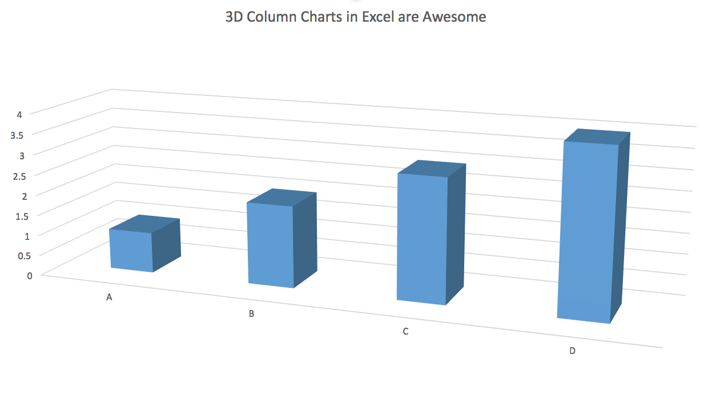


## The answer may surprise you. 

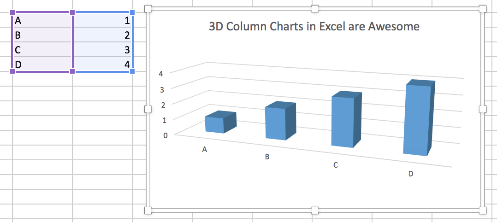


## What about this one?

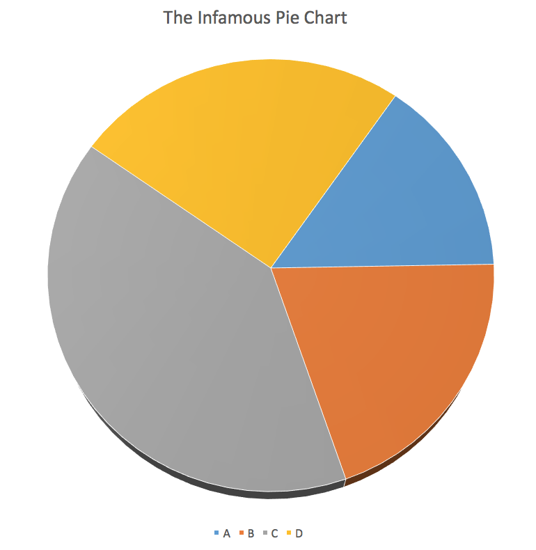


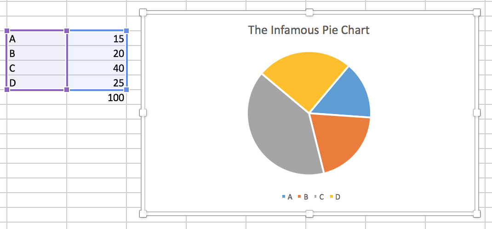


# What Makes Bad Figures Bad? 

- Sometimes, it's because they mislead or lend themselves to misinterpretation, either accidentally or on purpose. 
- Sometimes, it's just aesthetics. The chart is fine but it looks terrible.
- Sometimes, the figure is showing you less than it should, or could. 
- Sometimes, the figure is showing you way more than it should.
- As problems can go in both directions (too much; too little) we need more than pure taste to guide us.


## Simplify, Simplify

- Tufte emphasizes simplification and maximizing the "data to ink ratio".
- Show the data as much as you can, and avoid "chartjunk" and "ducks".

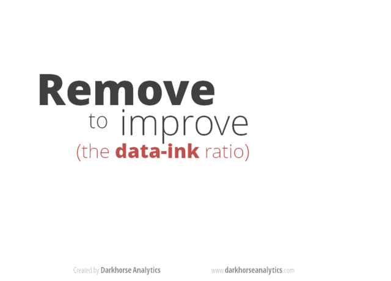


## William Cleveland

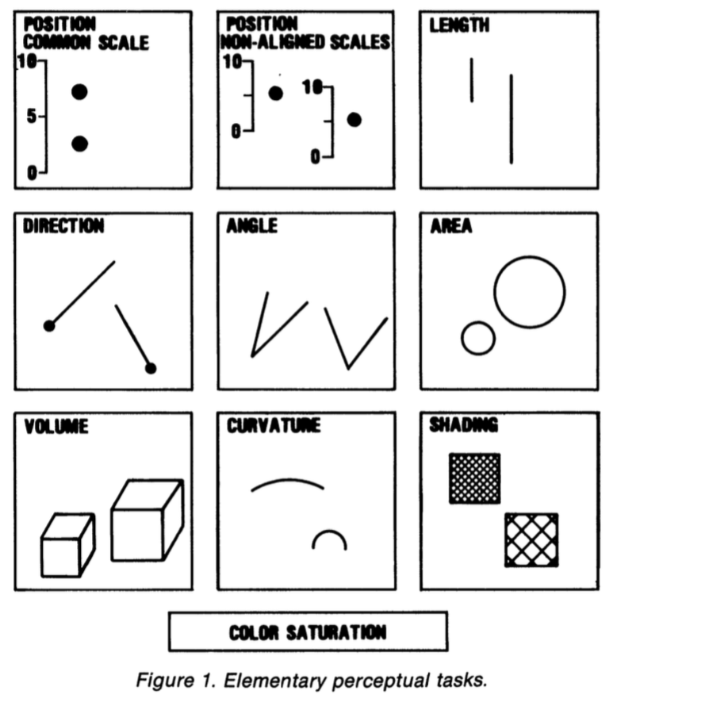

- It is difficult to compare length judgments without a common baseline.
- People misjudge *areas* easily. Area judgments are less accurate than length judgments or position judgments.
- People  misjudge *volumes* even more. This is one reason 3-D charts are usually terrible.
- People misjudge *angles*, as well. The size of acute angles is underestimated. The size of obtuse angles is overestimated. This is one reason pie charts are terrible.
- People find it hard to judge *slopes* and *changes in slope*. 
- Comparisons can't be made if people can't see the data points to begin with (e.g. if they overlap too much or are otherwise obscured.)
- Colors are good for distinguishing categories, but much less so the values of continuous variables.


## Chartjunk is terrible, but ...

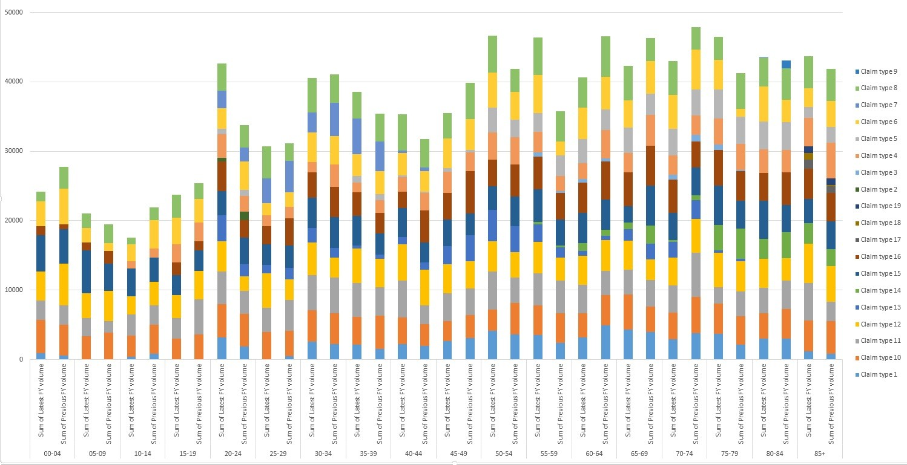

Ew.


## Removing Chartjunk won't fix Perceptual Problems

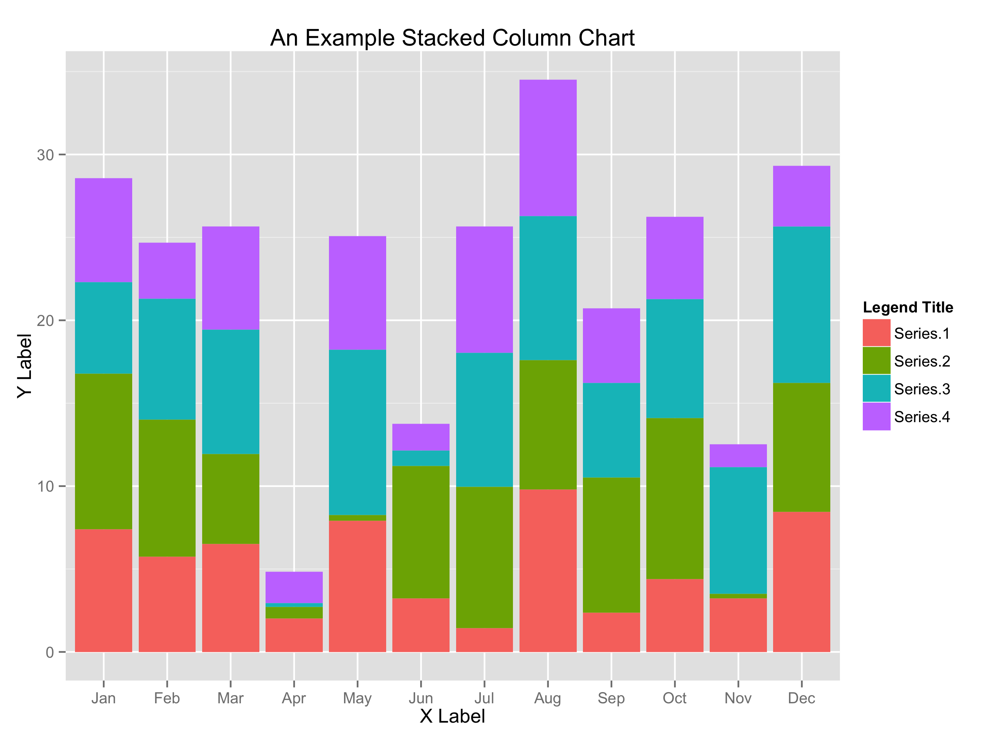


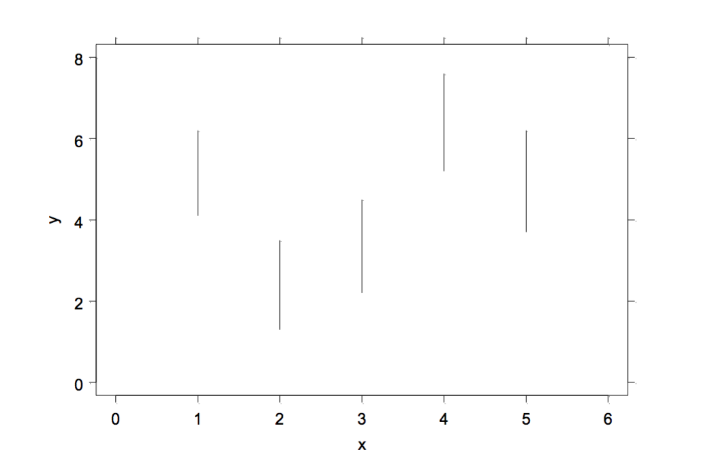


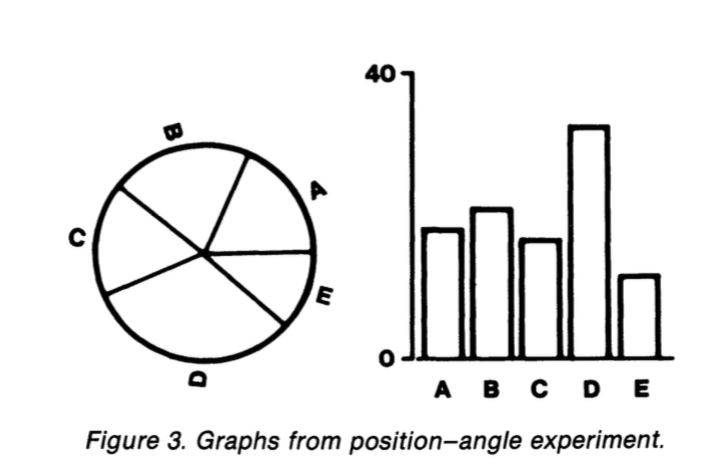


- What's the trend with these two curves?


- *Now* what's the trend?

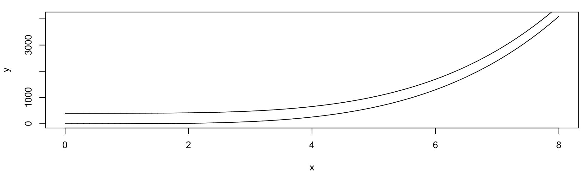

- We just adjusted the width of the figure, nothing else.


# Let's get some Data ...

```{r getdata-1, echo = TRUE}

## Helper libraries give you new functions to use
library(devtools)
library(ggplot2)

## Put the url in an object
gapminder.url <- "https://raw.githubusercontent.com/socviz/soc880/master/data/gapminder.csv"

## What is it?
class(gapminder.url)

```


```{r getdata-2, echo = TRUE}


## Make a new object
## Notice how we are using more than one function here
data <- read.csv(url(gapminder.url))

## What's the class?
class(data)

## What's inside?
str(data)

```

```{r getdata-3, echo = TRUE}

## Get the dimensions of the data frame
dim(data)

## Another way to look at a data frame
head(data)

```


## ... and get ready to plot it

```{r FirstPlot-2, fig.align = "center"}

## Make an object containing the plot
## try str(p) if you like. Objects can be complex!

p <- ggplot(data,
            aes(x = gdpPercap,
                y = lifeExp))


```


```{r FirstPlot-3}

## Take our data and make a scatter plot
p + geom_point()

```


# Homework

1. Create an RMarkdown file for your work if you haven't already.
2. Look again at the data.
3. Put `lifeExp` on the x-axis and `gdpPercap` on the y-axis.
4. Plot `pop` on the x-axis and gdpPercap on the y-axis.
5. Plot `year` on the x-axis and any continuous variable on the y-axis. 

