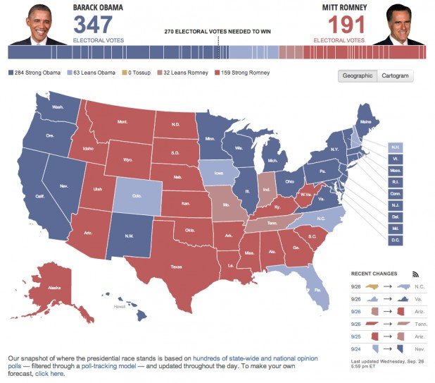
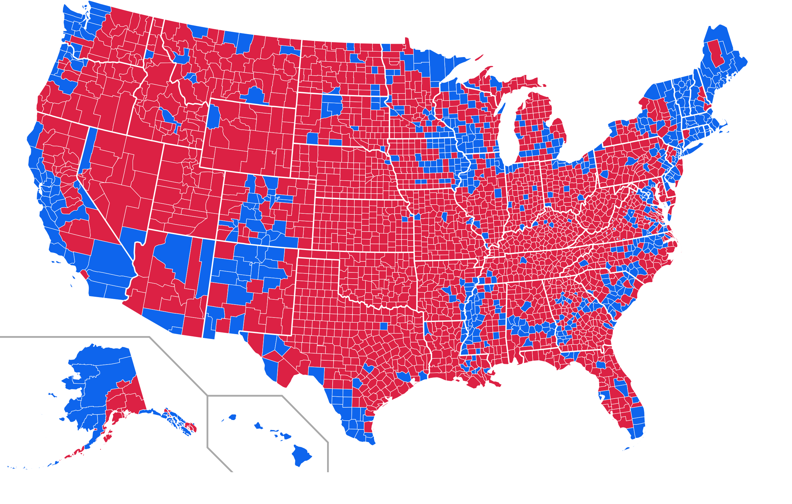
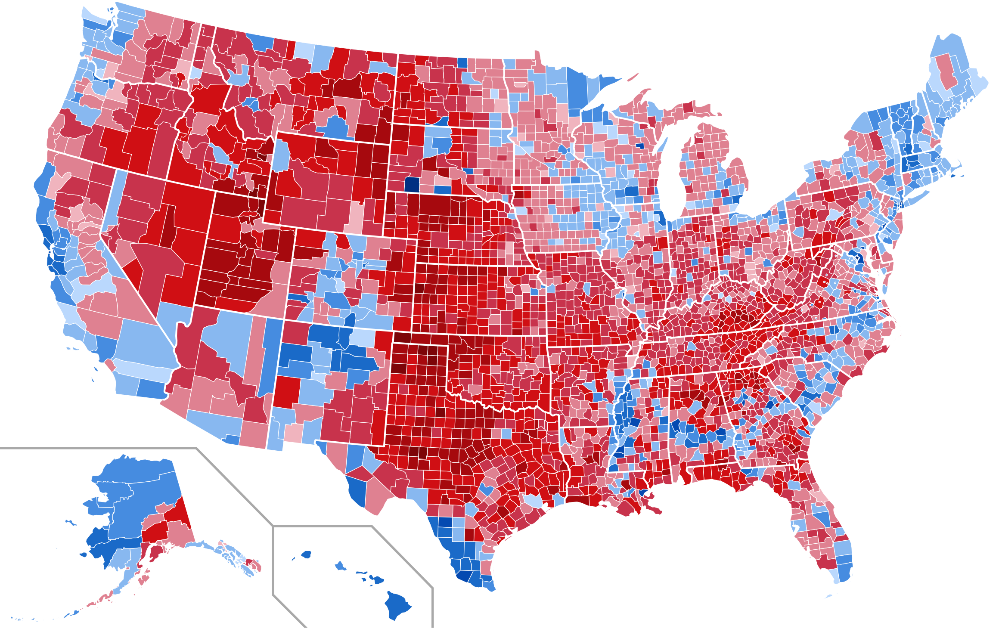
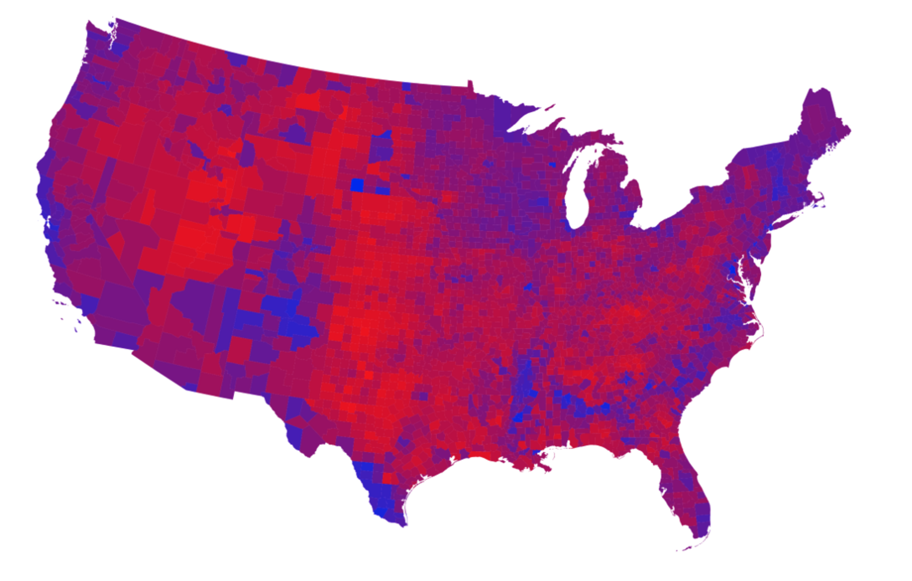
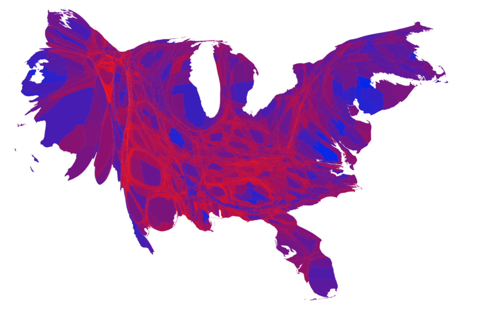
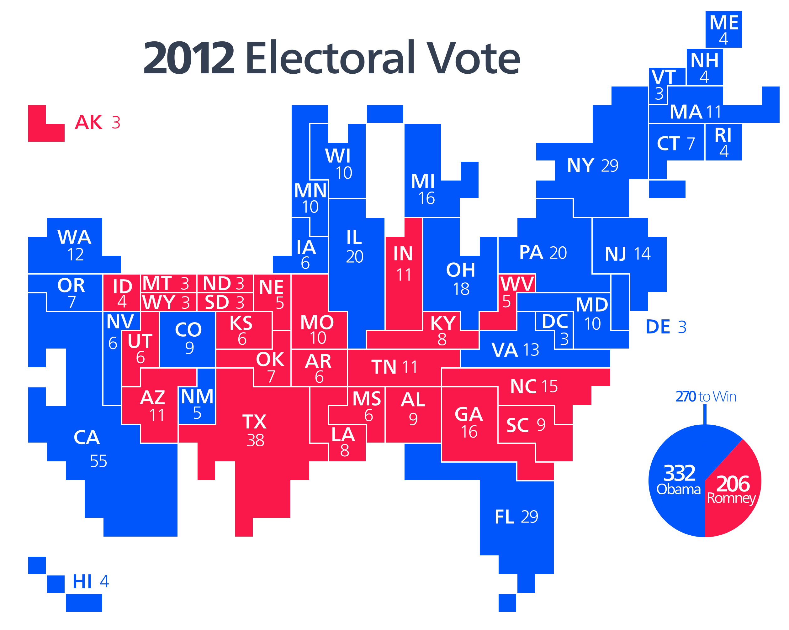
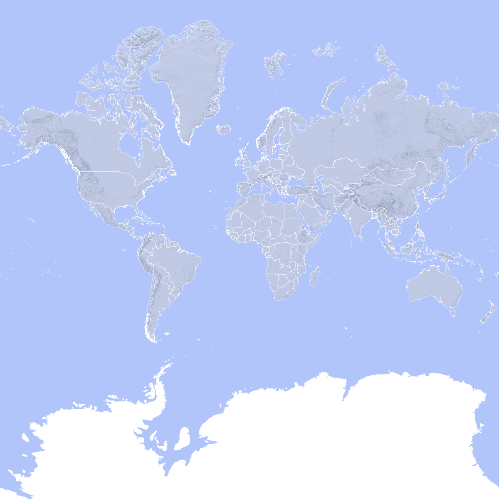
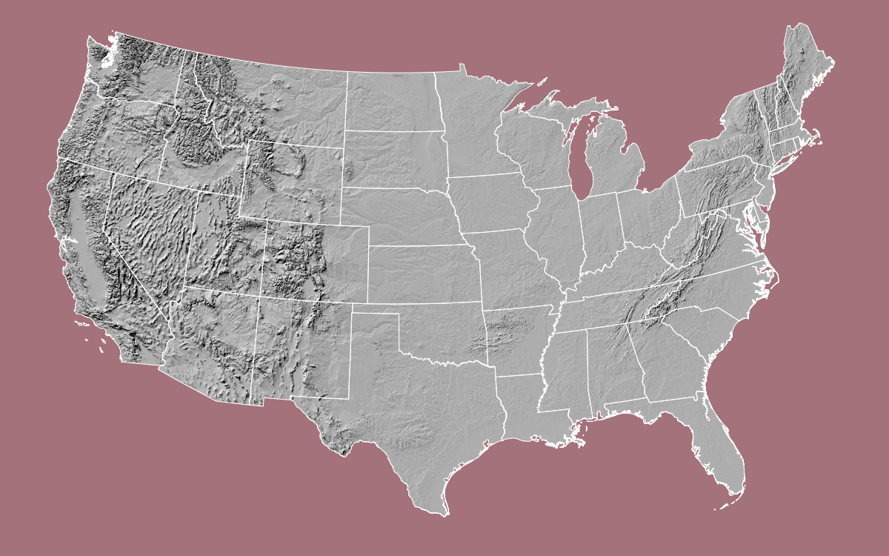
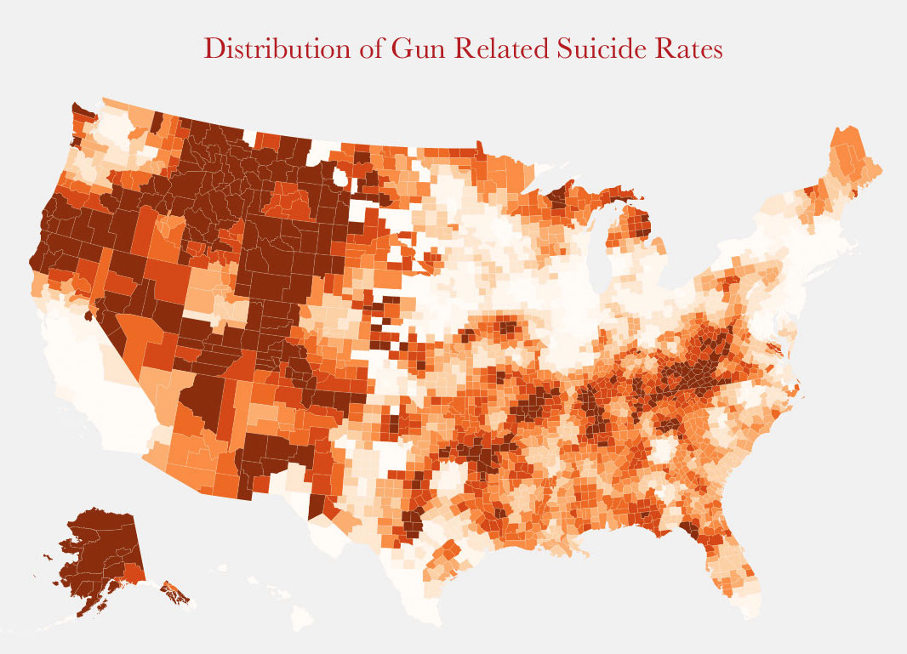
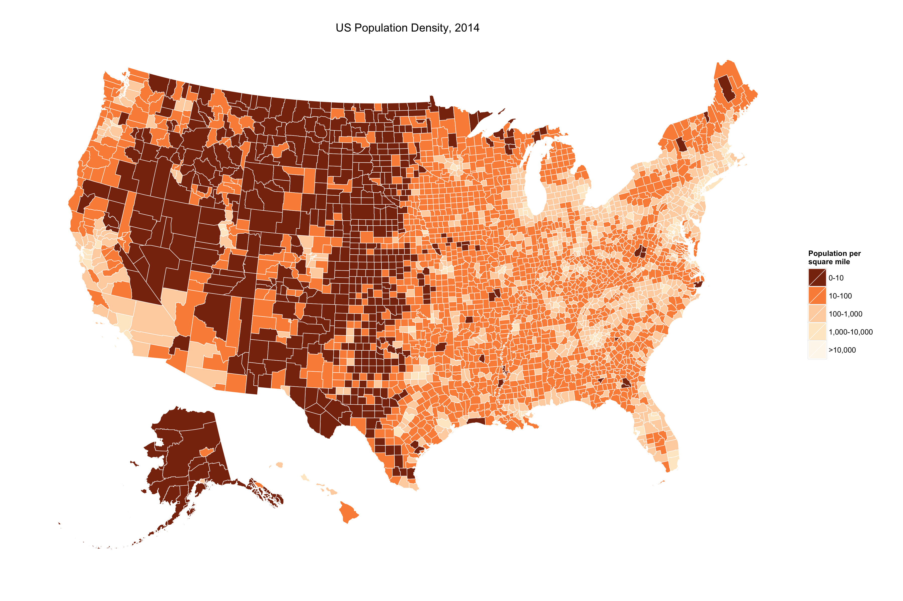

```{r Setup, include=FALSE, results='hide', warning=FALSE}

library(devtools)
library(ggplot2)

opts_chunk$set(fig.path="assets/wk05-fig-",
               cache.path="cache/wk05-working-",
               dev=c("png","pdf"),
               fig.width=6,
               fig.height=5,
               dpi=300,
               fig.show="hold",
               fig.lp="fig:",
               cache=TRUE,
               par=TRUE,
               echo=TRUE,
               message=FALSE,
               warning=FALSE)

opts_knit$set(kfigr.prefix=TRUE,
              kfigr.link=FALSE)

```

# Maps

- Choropleth maps are visually striking, but can also be a bit misleading. Consider some ways of representing election results. The fundamental issue is that people vote, not places.

## 2012 US Election, Winner by State




## 2012 US Election, Winner by County




## 2012 US Election, Winner by County Share




## 2012 US Election, Color-Centered




## 2012 US Election, Color-Centered, Scaled by Population




## 2012 US Election, Electoral College Cartogram




# Projections




## Four views of the US


## National Atlas




# America's Ur-Choropleths

In the U.S. case, the fact that states and counties vary widely in size and population means that they can be a bit misleading. And they make it easy to present a geographical distribution to insinuate an explanation. Together the results can be frustrating. Gabriel Rossman remarked to me a while ago that most choropleth maps of the U.S. for whatever variable in effect show population density more than anything else. (There's an [xkcd strip](https://xkcd.com/1138/) about this, too.) The other big variable, in the U.S. case, is Percent Black. Between the two of them, population density and percent black will do a lot to obliterate many a suggestively-patterned map of the United States. Those two variables aren't explanations of anything in isolation, but if it turns out it's more useful to know one or both of them instead of the thing you're plotting, you probably want to reconsider your theory.

So as a public service, here are America's two ur-choropleths, by county. First, Population Density.


And Percent Black:


Here we see a recently-tweeted map that makes the point. It shows county-level estimates of gun-related suicides.



Here's a map I drew that just shows population density, but reverse-coded so that the darker areas 1 fewer people.




# Often, you don't need a 'real' map

A consequence of the choropleth issue is that, especially for US State-level data, you may not need a fancy map at all.


## Statebins, by Bob Rudis

```{r}

devtools::install_github("hrbrmstr/statebins")
library(statebins)

dat <- read.csv("http://www.washingtonpost.com/wp-srv/special/business/states-most-threatened-by-trade/states.csv?cache=1", stringsAsFactors=FALSE)

```


```{r}

head(dat)

```


```{r}

p <- statebins(dat, "state", "avgshare94_00", breaks=4,
                labels=c("0-1", "1-2", "2-3", "3-4"),
                legend_title="Share of workforce with jobs lost or threatened by trade",
                font_size=3)

p + theme(legend.position="bottom") +
    ggtitle("1994-2000")


```


```{r}

p <- statebins_continuous(dat, "state", "avgshare01_07",
               legend_title="Share of workforce with jobs lost or threatened by trade",
               brewer_pal = "OrRd",
                font_size=3)

p + theme(legend.position="bottom") +
    ggtitle("2001-2007")


```


```{r}

library(httr)
library(dplyr)

election_2012 <- GET("https://raw.githubusercontent.com/hrbrmstr/statebins/master/tmp/election2012.csv")

results <- read.csv(textConnection(content(election_2012, as="text")),
                    header=TRUE, stringsAsFactors=FALSE)

results <- results %>%
    mutate(color=ifelse(is.na(Obama), "#2166ac", "#b2182b")) %>%
    select(state, color) 

```


```{r}

head(results, 15)

```


```{r}

results %>%
    statebins_manual(font_size=4, text_color = "white",
                     labels=c("Romney", "Obama"),
                     legend_position="right",
                     legend_title="Winner")

```


# US County Maps in R

Let's make the Ur-Choropleths. This code borrows heavily from exellent work by Bob Rudis: `https://github.com/hrbrmstr/rd3albers`. You can get the county map repository from the terminal:
`git clone https://github.com/kjhealy/us-county.git`. Or clone it in your browser, or git client.

## Setting up the data

```{r}

library(maptools)
library(mapproj)
library(rgeos)
library(rgdal)
library(RColorBrewer)
library(ggplot2)
library(stringr)
library(scales)
library(RColorBrewer)

theme_set(theme_minimal())

## for theme_map
## devtools::source_gist("33baa3a79c5cfef0f6df")

theme_map <- function(base_size=9, base_family="") {
    require(grid)
    theme_bw(base_size=base_size, base_family=base_family) %+replace%
    theme(axis.line=element_blank(),
          axis.text=element_blank(),
          axis.ticks=element_blank(),
          axis.title=element_blank(),
          panel.background=element_blank(),
          panel.border=element_blank(),
          panel.grid=element_blank(),
          panel.margin=unit(0, "lines"),
          plot.background=element_blank(),
          legend.justification = c(0,0),
          legend.position = c(0,0)
          )
}


```

First we need an actual map --- the US census shapefiles, converted to geojson format.

```{r}

## US Census Shapefiles
## https://www.census.gov/geo/maps-data/data/cbf/cbf_counties.html

## Converted to geojson format
## http://eric.clst.org/Stuff/USGeoJSON
## Read U.S. counties moderately-simplified GeoJSON file
us.counties <- readOGR(dsn="assets/gz_2010_us_050_00_5m.json",
                       layer="OGRGeoJSON")

```

Next, we transform the map data to an Albers equal area projection.

```{r}

# Convert it to Albers equal area
us.counties.aea <- spTransform(us.counties,
                               CRS("+proj=laea +lat_0=45 +lon_0=-100 +x_0=0 +y_0=0 +a=6370997 +b=6370997 +units=m +no_defs"))

us.counties.aea@data$id <- rownames(us.counties.aea@data)

```

We want to have a large map focused on the lower 48, but also preserve Alaska and Hawaii. So we extract, rotate, and move those two states. The state code numbers are standard FIPS codes, by the way.

```{r}

# Extract, then rotate, shrink & move alaska (and reset projection)
# need to use state IDs via # https://www.census.gov/geo/reference/ansi_statetables.html
alaska <- us.counties.aea[us.counties.aea$STATE=="02",]
alaska <- elide(alaska, rotate=-50)
alaska <- elide(alaska, scale=max(apply(bbox(alaska), 1, diff)) / 2.3)
alaska <- elide(alaska, shift=c(-2100000, -2500000))
proj4string(alaska) <- proj4string(us.counties.aea)

# extract, then rotate & shift hawaii
hawaii <- us.counties.aea[us.counties.aea$STATE=="15",]
hawaii <- elide(hawaii, rotate=-35)
hawaii <- elide(hawaii, shift=c(5400000, -1400000))
proj4string(hawaii) <- proj4string(us.counties.aea)

# remove old states and put new ones back in; note the different order
# we're also removing puerto rico in this example but you can move it
# between texas and florida via similar methods to the ones we just used
us.counties.aea <- us.counties.aea[!us.counties.aea$STATE %in% c("02", "15", "72"),]
us.counties.aea <- rbind(us.counties.aea, alaska, hawaii)


```

This just gives us a map. Next we will merge in some state- and county-level data that we can actually plot.

```{r}

state.data <- read.csv("assets/state-data-statabs-2012.csv", header=TRUE)

county.names <- read.csv("assets/fips-by-state.csv", header=TRUE)

county.data <- read.csv("assets/DataSet.txt", header=TRUE)
county.data$id <- as.character(county.data$fips)
ind <- county.data$fips<10000
county.data$id[ind] <- paste("0", county.data$id[ind], sep="")
county.data$id[county.data$id=="00"] <- "0"

ind <- match(county.data$fips, county.names$fips)
county.data$name <- county.names$name[ind]
county.data$state <- county.names$state[ind]

ind <- match(state.data$fips, county.data$fips)
county.data$state[ind] <- state.data$State.Abbr

## Add state names as levels of county name, so states have FIPS too
levels(county.data$name) <- c(levels(county.data$name), levels(state.data$State))
county.data$name[ind] <- state.data$State


### Add census region. Don't call the variable "region" because that's
### already reserved by the map object
ind <- match(county.data$state, state.data$State.Abbr)
county.data$census.region <- state.data$Region[ind]


```

The next step is to cut the population density into some bins.

```{r}

library(Hmisc)
county.data$pop.dens <- with(county.data, PST045214/LND110210)
county.data$pop.dens <- cut2(county.data$pop.dens,
                             cuts = c(0, 10, 100, 1000, 10000))

county.data$pct.black <- cut2(county.data$RHI225213,
                              cuts = c(0, 2, 5, 10, 15, 25, 50))

```

Then we "fortify" the US County map data. In effect we create a data frame that ggplot can use. And we merge that spatial data with our county-level census data.

```{r}

co.map <- fortify(us.counties.aea, region="GEO_ID")
co.map$id <- str_replace(co.map$id, "0500000US", "")

co.map <- merge(co.map, county.data, by="id")

```

## Drawing the Maps

### Population Density

```{r}

p <- ggplot(data=co.map, aes(x=long, y=lat, group=group))

p1 <- p + geom_map(data=co.map,
                   map = co.map,
                   aes(map_id=id,
                       x=long,
                       y=lat,
                       group=group,
                       fill=pop.dens),
                   color="white",
                   size=0.2)

p2 <- p1 + scale_fill_brewer(palette="PuBu",
                             labels = c("0-10", "10-100", "100-1,000",
                                        "1,000-10,000", ">10,000"))
p2 <- p2 + coord_equal()
p2 <- p2 + theme_map()
p2 <- p2 + theme(legend.position="right") + labs(fill="Population per\nsquare mile")
p2 <- p2 + ggtitle("US Population Density, 2014")
p2

```

### Percent Black

```{r}

### Percent Black
p <- ggplot(data=co.map, aes(x=long, y=lat, group=group))

p1 <- p + geom_map(data=co.map,
                   map = co.map,
                   aes(map_id=id,
                       x=long,
                       y=lat,
                       group=group,
                       fill=pct.black),
                   color="white",
                   size=0.2)

p2 <- p1 + scale_fill_brewer(palette="Oranges",
                             labels = c("<2", "2-5", "5-10",
                                        "10-15", "15-25", "25-50", ">50"))
p2 <- p2 + coord_equal()
p2 <- p2 + theme_map()
p2 <- p2 + theme(legend.position="right") + labs(fill="Percent of\nPopulation, 2013")
p2 <- p2 + ggtitle("US Population, Percent Black")
p2

```

## Subsetting

Note that once we have the data frame set up, we can subset it just like we would for any other dataset. For instance, let's take a look at Mississippi.

```{r}

p <- ggplot(data=subset(co.map, state == "MS"), aes(x=long, y=lat, group=group))

p1 <- p + geom_map(data = subset(co.map, state == "MS"),
                   map = subset(co.map, state == "MS"),
                   aes(map_id=id,
                       x=long,
                       y=lat,
                       group=group,
                       fill=pct.black),
                   color="white",
                   size=0.2)

p2 <- p1 + scale_fill_brewer(palette="Oranges",
                             labels = c("<2", "2-5", "5-10",
                                        "10-15", "15-25", "25-50", ">50"))

p2 <- p2 + coord_equal()
p2 <- p2 + theme_map()
p2 <- p2 + theme(legend.position="right") + labs(fill="Percent of \nPopulation, 2013")
p2 <- p2 + ggtitle("MS State Population, Percent Black")
p2


```


## See also

- The code and data used to produce the maps in this post: [The Federal Government Owns a Lot of Land](http://kieranhealy.org/blog/archives/2016/01/03/the-federal-government-owns-a-lot-of-land/)
